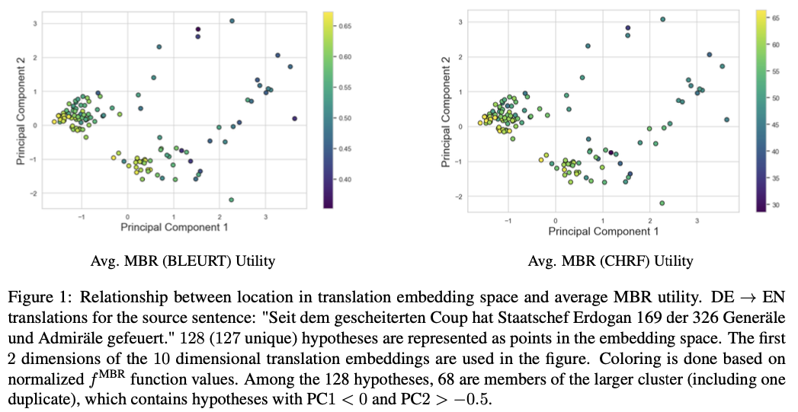
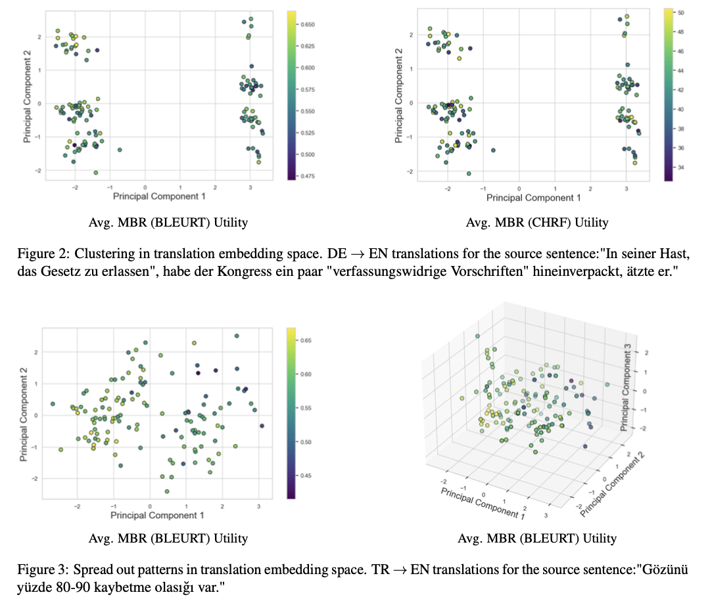
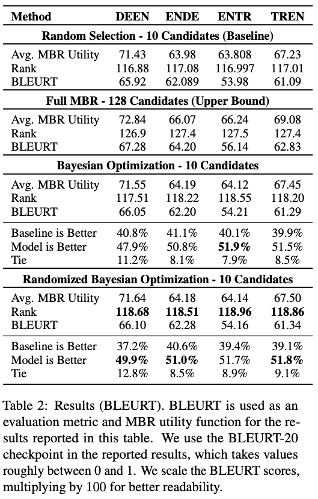
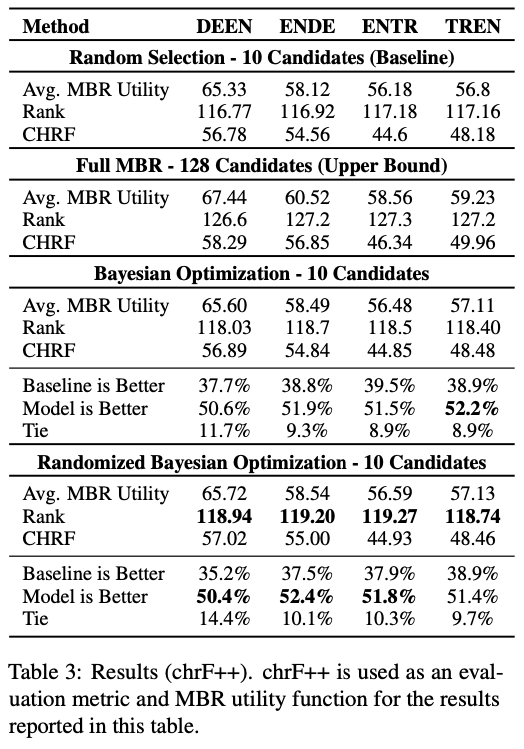
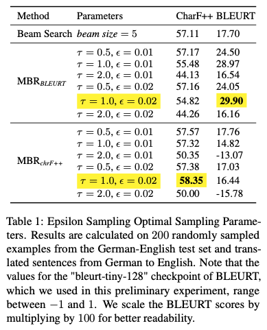

# Bayesian Optimization for Guided Hypothesis Sampling in Minimum Bayes Risk Decoding

[](https://drive.google.com/file/d/1irfeto2mPHuTviJ-Dl0K4dkufrMTyp0l/view?usp=sharing)
[](https://drive.google.com/drive/folders/1PzNdEactL4S8OVCGuX-0I2za49H2wM1c?usp=drive_link)
[](https://www.cl.cam.ac.uk/teaching/2324/L101/)

## Abstract
Minimum Bayes risk (MBR) decoding is an inference method used in conditional language generation tasks, such as neural machine translation. Unlike maximum a posteriori (MAP) decoding, which selects the hypothesis with the highest probability under the model's distribution, MBR identifies the hypothesis that is most representative of the model's distribution as a whole. This method has been observed to improve model performance in various tasks, especially when combined with neural-based utility functions. However, MBR decoding remains impractical for most use cases due to its quadratic computational complexity. In this paper, we explore guided hypothesis sampling with Bayesian optimization to address the computational challenges of MBR decoding. Particularly, we demonstrate that guided hypothesis performs better than random hypothesis sampling for a fixed number of calls to the utility function. Our investigation of the distribution of hypothesis translations reveals that the hypotheses are often clustered in distinct regions in the embedding space, with observable relationships between their location and MBR score. We demonstrate the merits of our approach with neural machine translation experiments on two language pairs (DE-EN \& TR-EN), using chrF++ and BLEURT as evaluation metrics and MBR utility functions.

## Clustered Hypotheses



## Evaluations




## Citation
```bibtex
@article{differentinductivebias2024,
    title={Bayesian Optimization for Guided Hypothesis Sampling in Minimum Bayes Risk Decoding},
    author={El, Batu},
    journal={preprint},
    year={2024}
}
